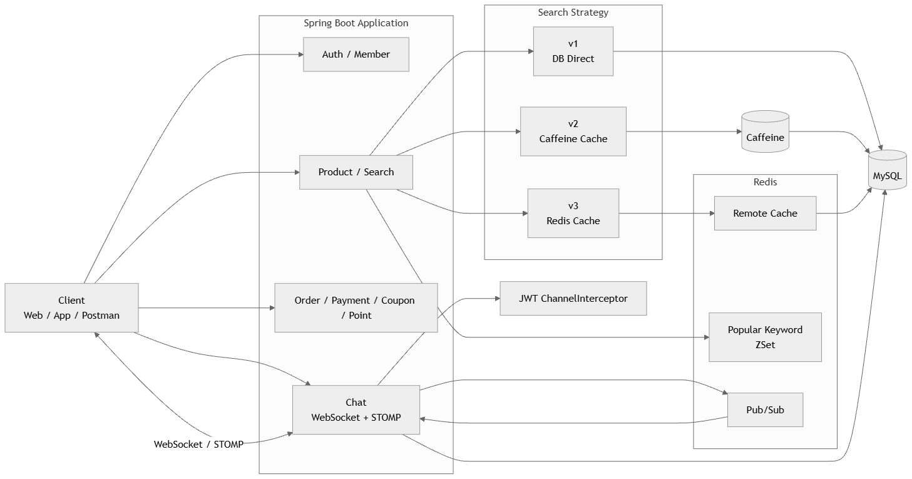
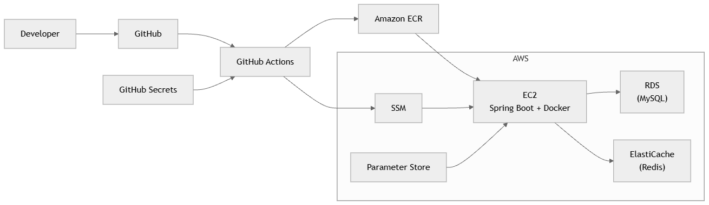
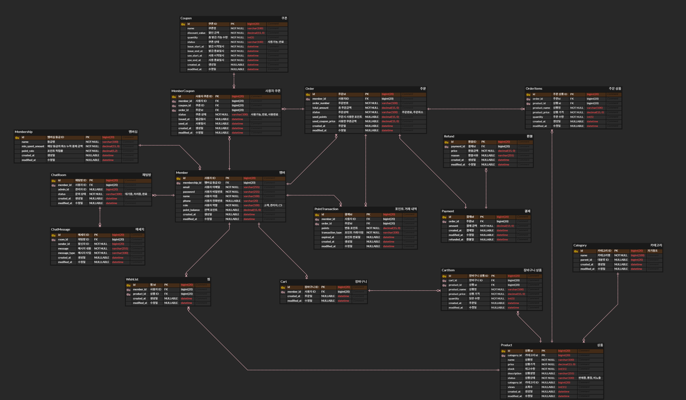

# 💄 Olive_Life(Olive_삶)

<p align="center">
  뷰티 커머스 플랫폼 백엔드 서비스<br>
  검색 캐싱 · 동시성 제어 · 실시간 채팅 · 인덱스 최적화 · AWS 기반 CI/CD
</p>

---

<p align="center">
  
  
  
  
  
  
  
  
  
  
</p>

---

## 📌 프로젝트 소개

이 프로젝트는 **뷰티 커머스 플랫폼 백엔드 서비스**로,  
상품 조회 및 검색, 장바구니, 주문/결제, 쿠폰/포인트, 실시간 CS 채팅, 관리자 기능까지 포함한 서비스를 구현하는 것을 목표로 했습니다.

특히 이번 프로젝트에서는 단순 CRUD 구현을 넘어서, 다음과 같은 실제 서비스 운영 관점의 문제를 해결하는 데 집중했습니다.

- 검색 API 응답 속도 개선을 위한 **캐싱 전략 적용**
- 선착순/동시 요청 상황에서의 **데이터 정합성 보장**
- 대용량 데이터 환경에서의 **인덱스 최적화**
- 고객 문의 대응을 위한 **실시간 채팅**
- 반복 가능한 배포를 위한 **Docker + AWS + GitHub Actions 기반 CI/CD 자동화**

---

## ✅ 요구사항 반영 요약

| 구분 | 구현 내용                             | 비고                                               |
|---|-----------------------------------|--------------------------------------------------|
| 동시성 제어 | 낙관적 락, 비관적 락, MySQL 락, Redis 분산락  | 성능비교                                             |
| 캐싱 | 검색 API v1 / v2 / v3 구성            | v1: DB 직접 조회 / v2: Local Cache / v3: Redis Cache |
| 인기 검색어 | [구현 여부 및 방식 입력]                   | [예: Redis ZSet]                                  |
| 인덱스 최적화 | 병목 쿼리 선정 및 EXPLAIN 비교             | Before / After 정리                                |
| 실시간 채팅 | WebSocket + STOMP + Redis Pub/Sub | JWT 인증 포함                                        |
| 배포 / CI | Docker, AWS, GitHub Actions       | CI / CD 자동화                                      |

---

## 👥 팀 소개

| 이름  | 역할 | 담당                                  |
|-----|---|-------------------------------------|
| 최길중 | 팀장 / 인프라 | Git 초기 세팅, Docker 환경 구성, CI/CD 구축, 인덱스 최적화 |
| 김소현 | 웹소켓 | 실시간 채팅, K6 부하테스트 |
| 박영수 | [역할] | [담당 기능]                             |
| 이승현 | 동시성  | 장바구니, 주문, 쿠폰, 동시성 테스트               |

### 📎 프로젝트 문서
- [프로젝트 노션](https://www.notion.so/teamsparta/3-3332dc3ef51480eb9e10eaaa7c65907f?source=copy_link)
- [API 명세서](링크 입력)
- [테스트 케이스](링크 입력)
- 동시성 테스트 시나리오: https://www.notion.so/teamsparta/34a2dc3ef51480f68a06e1a93ec6949b?source=copy_link
- 부하 테스트 시나리오: https://www.notion.so/teamsparta/K6-3452dc3ef51480c2969ef5a57686466a

---

## ⏲️ 개발 기간

- 2026.04.08 ~ 2026.04.28

### 진행 흐름
- 1주차: 기획, 와이어프레임, ERD, API 명세서 작성
- 2주차: 핵심 도메인 구현, 검색 API, 동시성 제어, 실시간 채팅, Docker 구성
- 3주차: 인덱스 최적화, 성능 테스트, AWS 인프라, CI/CD, README 및 발표 준비

---

## 🛠 기술 스택

### Backend
<p>
  
  
  
  
  
</p>

### Database / Cache / Messaging
<p>
  
  
  
</p>

### Real-time
<p>
  
  
  
</p>

### Infra / DevOps
<p>
  
  
  
  
  
  
  
</p>

### Test / Monitoring
<p>
  
  
  
  
  
</p>

### Collaboration
<p>
  
  
  
</p>

---

## 🧩 아키텍처

### 서비스 아키텍처
<p align="center">
  
</p>

- Client 요청은 Spring Boot 애플리케이션에서 처리합니다.
- 상품 검색은 v1 / v2 / v3로 분리하여 캐시 전략 차이를 비교합니다.
- 실시간 채팅은 WebSocket + STOMP 기반으로 동작하며, 분산 환경에서는 Redis Pub/Sub으로 메시지를 브로드캐스팅합니다.
- 데이터 저장은 MySQL, 캐시 및 메시지 브로커 역할은 Redis가 담당합니다.

### 인프라 아키텍처
<p align="center">
  
</p>

- GitHub Actions를 통해 테스트, 빌드, 이미지 푸시, 배포를 자동화했습니다.
- 애플리케이션은 EC2에서 Docker 컨테이너로 실행됩니다.
- 데이터베이스는 RDS(MySQL), 캐시 및 Pub/Sub은 ElastiCache(Redis)를 사용합니다.
- 민감 정보는 GitHub Secrets와 AWS Parameter Store로 분리 관리합니다.

---

## 🗄 ERD

<p align="center">
  
</p>

### 핵심 관계
- 회원은 주문, 포인트, 장바구니, 채팅방, 쿠폰 발급 이력과 연결됩니다.
- 상품은 카테고리에 속하고, 장바구니/주문/찜 기능과 연결됩니다.
- 주문, 결제, 환불은 분리된 구조로 관리합니다.
- 채팅방과 채팅 메시지는 실시간 문의 흐름을 반영하도록 설계했습니다.

---

## 🚀 주요 기능

### 인증 / 회원
- 회원가입
- 로그인 / 로그아웃
- 내 정보 조회
- JWT 기반 인증/인가

### 상품 / 검색
- 상품 목록 조회
- 상품 상세 조회
- 검색 API v1 / v2 / v3
- 인기 검색어 조회

### 장바구니 / 주문 / 결제
- 장바구니 담기 / 수정 / 삭제
- 주문 생성
- 즉시결제 / 장바구니 결제
- 쿠폰 / 포인트 적용

### 실시간 채팅
- 채팅방 생성 / 입장 / 퇴장
- 실시간 메시지 전송
- 메시지 저장 및 조회
- 문의 상태 관리 

---

## 🧠 기술 선택 근거 및 요구사항 기반 구현

### 1. 캐싱

#### 왜 검색 API에 캐시를 적용했는가
검색 API는 동일 키워드에 대한 반복 요청이 많고, 데이터 양이 증가할수록 DB 부하가 커지기 때문에 캐시 적용 효과를 가장 잘 확인할 수 있는 대상이었습니다.  
이에 따라 성능 비교를 위해 검색 API를 다음 3단계로 분리했습니다.

- **v1**: DB 직접 조회
- **v2**: Caffeine 기반 Local Cache 적용
- **v3**: Redis 기반 Remote Cache 적용

#### 캐시 전략
- Cache-aside 전략 사용
- 캐시 키: `[추가 예정]`
- TTL: `[추가 예정]`
- Local Cache 구현체: Caffeine
- Scale-out 환경 대응: Redis Cache

#### 인기 검색어
- 자료구조: `[추가 예정]`
- 집계 기준: `[추가 예정]`
- 중복 카운팅 방지 전략: `[추가 예정]`

#### 선택 이유
- Local Cache는 단일 서버 환경에서 빠른 응답을 제공할 수 있습니다.
- 그러나 다중 서버 환경에서는 캐시 공유가 불가능하므로, 공용 캐시 저장소가 필요했습니다.
- 이를 해결하기 위해 Redis 기반 Remote Cache로 확장했습니다.

---

### 2. 동시성 제어

#### 문제 상황
선착순 쿠폰 발급 / 즉시 결제 / 장바구니 결제와 같이 동시에 많은 요청이 몰리는 상황에서는 재고 초과 차감, 중복 처리, 정합성 깨짐 문제가 발생할 수 있습니다.

#### 테스트 방식
- 여러 스레드가 동시에 동일한 자원에 접근하는 시나리오를 구성했습니다.
- `ExecutorService`, `CyclicBarrier`, `CountDownLatch`를 사용하여 동시 출발 및 전체 완료 시점을 제어했습니다.

#### 최종 선택한 락 방식
- Redis 분산 락 (Retry with Backoff 전략)

#### 선택 이유
 대규모 트래픽 환경에서 DB 자원을 보호하면서도 '쿠폰 전량 소진' 이라는 비즈니스 요구사항을 충족하기 위해 선택.(Scale-out 환경까지 대응 가능)
- 낙관적 락 : 정합성은 보장되나, 극심한 경합 환경에서 롤백 및 `재시도 폭증`으로 인한 성능 저하 및 서버 부하 발생.
- 비관적 락 : 성능은 우수하나, `DB 커넥션 점유`로 인한 서비스 장애의 위험 존재.
- MySQL 네임드 락 : 분산락과 같은 기능을 하지만, `커넥션 2개`를 사용한다는 치명적 단점 존재.

#### 락 설계
- 락 키: `lock:coupon:{couponId}`
- TTL: `2초`
- 실패 전략: `Retry with backoff 전략`
- 재시도 횟수: `8회`
- 재시도 간격: `50ms`
- 안전한 해제 방식: `UUID + Lua Script`

#### 트러블슈팅 요약
fetch join + 영속성 컨텍스트로 인해 최신 재고 반영 실패
- 문제 상황 : `비관적 락`을 적용했음에도 불구하고 재고가 정확하게 차감되지 않는 문제 발생
- 원인 : 락 획득 전 `fetch join` 실행으로 인해, `JPA 1차 캐시`에 캐싱된 과거 데이터가 최신 DB 데이터를 무시하고 덮어쓰는 `갱신 손실` 발생
- 해결 : `패치조인 제거 + Lazy 로딩` 방식으로 수정하여 정합성을 확보.

---

### 3. 인덱스 최적화

#### 최적화 대상 쿼리 선정
- 대상 쿼리:
```sql
select id
from product
where category_id = ?
  and status = ?
  and name like '립%'
order by name asc
limit 20;
```

- 선정 이유:
    - 검색 조건과 정렬 조건이 함께 포함된 쿼리라 대용량 데이터에서 성능 차이를 확인하기 적합했습니다.

#### Before EXPLAIN
| id | select_type | table | partitions | type | possible_keys | key | key_len | ref | rows | filtered | Extra |
|:--:|:-----------:|:-----:|:----------:|:----:|:-------------|:---|:-------:|:---:|:----:|:--------:|:------|
| 1 | SIMPLE | product | null | ref | idx_product_category_id | idx_product_category_id | 8 | const | 3571 | 3.7 | Using where; Using filesort |

#### 적용한 인덱스
```sql
create index idx_product_category_status_name
on product (category_id, status, name);
```

#### 인덱스 설계 이유
- `category_id`, `status`로 먼저 필터링하고, `name`으로 접두어 검색과 정렬을 함께 처리하기 위해 복합 인덱스로 구성했습니다.

#### After EXPLAIN
| id | select_type | table | partitions | type | possible_keys | key | key_len | ref | rows | filtered | Extra |
|:--:|:-----------:|:-----:|:----------:|:----:|:-------------|:---|:-------:|:---:|:----:|:--------:|:------|
| 1 | SIMPLE | product | null | range | idx_product_category_id, idx_product_category_status_name | idx_product_category_status_name | 411 | null | 350 | 100 | Using where; Using index |


#### 요약
- `type`: `ref` → `range`
- `key`: `idx_product_category_id` → `idx_product_category_status_name`
- `rows`: `3571` → `350`
- `Extra`: `Using where; Using filesort` → `Using where; Using index`

---

### 4. 실시간 채팅

#### 선택 기술
- WebSocket
- STOMP
- Redis Pub/Sub

#### 선택 이유
- HTTP Polling 방식보다 지연이 적고, 양방향 통신이 가능하기 때문에 실시간 문의 기능에 적합했습니다.
- STOMP를 적용해 메시지 발행/구독 구조를 명확하게 분리했습니다.
- 서버가 여러 대일 때 메시지가 누락되지 않도록 Redis Pub/Sub을 도입했습니다.

#### 구현 내용
- 채팅방 생성 / 입장 / 퇴장
- 메시지 전송 및 저장
- 메시지 조회 API
- 채팅방별 destination 분리
- JWT 기반 사용자 인증
- ChannelInterceptor에서 CONNECT 시점 인증 처리

#### 추가 고려사항
- 재연결 전략: `[추가 예정]`
- 미수신 메시지 복구: `[추가 예정]`

---

### 5. 배포와 CI/CD

#### Docker
- Dockerfile 작성
- docker-compose 기반 로컬 개발 환경 구성
- 애플리케이션, MySQL, Redis 컨테이너 실행

#### AWS 인프라
- EC2: 애플리케이션 실행
- RDS: MySQL 운영 DB
- ElastiCache: Redis 캐시 / Pub/Sub
- VPC 내부 통신 구성

#### CI
- GitHub Actions에서 빌드 / 테스트 / Docker 이미지 빌드 / ECR Push 수행
- PR에서는 테스트만 실행하고, main 브랜치 push 시에만 Docker Push가 진행되도록 구성

#### CD
- SSM + Docker Pull 방식 적용
- GitHub Actions에서 SSM으로 EC2에 명령 전달
- 최신 이미지 pull 후 기존 컨테이너 중지 / 삭제, 새 컨테이너 실행
- 배포 완료 후 `/actuator/health` 헬스체크 API 호출

#### 민감 정보 관리
- GitHub Secrets: CI/CD 파이프라인용 값
- AWS Parameter Store: 런타임 환경 변수
- 배포할 때 필요한 값과 실제 서버 실행에 필요한 값을 분리해 관리

---

## 📈 성능 비교

### 테스트 목적
- 캐시 적용 전후 검색 API 응답 시간 비교
- 인덱스 적용 전후 쿼리 성능 비교
- 부하 상황에서 시스템 안정성 확인

### 테스트 환경
- 도구: k6
- 모니터링: Grafana, InfluxDB
- 부하 방식: Ramp-up + Steady-state
- 데이터 규모: `[예: 5만 건 이상 더미 데이터]`

### 1. 검색 API 성능 비교

| 항목 | v1 (DB 직접 조회) | v2 (Local Cache) | v3 (Redis Cache) |
|:---:|:---:|:---:|:---:|
| 평균 응답 시간 | [입력] | [입력] | [입력] |
| p95 | [입력] | [입력] | [입력] |
| TPS | [입력] | [입력] | [입력] |
| 실패율 | [입력] | [입력] | [입력] |

### 2. 인덱스 적용 전후 비교

| 항목 | Before | After |
|:---:|:---:|:---:|
| 실행 시간 | [입력] | [입력] |
| type | [입력] | [입력] |
| key | [입력] | [입력] |
| rows | [입력] | [입력] |
| Extra | [입력] | [입력] |

### 결과 요약
- v1 대비 v2는 `[입력]`
- v2 대비 v3는 `[입력]`
- 인덱스 적용 후 `[입력]`

---

## 🖼 API 명세서

- Notion: [링크 입력]

대표 API는 아래 문서에서 확인할 수 있습니다.

---

## 🗒 Test Case

- 테스트 케이스 문서: [링크 입력]

---

## 📁 프로젝트 파일 구조

```text
Olive-Life/
├── .github/
│   └── workflows/
│       └── ci.yml
├── docs/
│   ├── images/
│   └── troubleshooting/
├── gradle/
│   └── wrapper/
├── infra/
│   └── nginx/
│       └── nginx.conf
├── src/
│   ├── main/
│   │   ├── java/
│   │   └── resources/
│   └── test/
│       ├── java/
│       └── resources/
├── .dockerignore
├── .env.example
├── build.gradle
├── docker-compose.yml
├── docker-compose.coupon.yml
├── Dockerfile
├── ReadMe.md
├── settings.gradle
├── gradlew
└── gradlew.bat
```

---

### 3조
👉 [커머스 결제 시스템 트러블 슈팅 - 양식](docs/troubleshooting/양식.md) <br>
👉 [커머스 결제 시스템 트러블 슈팅 - 최길중](docs/troubleshooting/giljung.md) <br>
👉 [커머스 결제 시스템 트러블 슈팅 - 김소현](docs/troubleshooting/sohyun.md) <br>
👉 [커머스 결제 시스템 트러블 슈팅 - 박영수](docs/troubleshooting/yeongsu.md) <br>
👉 [커머스 결제 시스템 트러블 슈팅 - 이승현](docs/troubleshooting/seunghyeon.md) <br>
